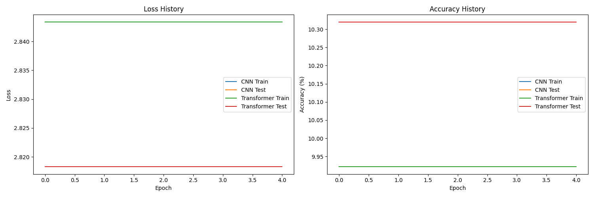

# EPAiV5-Session27 - Custom CNN & Custom Transformer

## Overview

This project showcases a deep learning implementation combining custom-built components for a Convolutional Neural Network (CNN) and foundational transformer-inspired elements. The notebook provides an end-to-end demonstration of designing, implementing, and testing a neural network with custom layers.

The project emphasizes learning and exploring the fundamentals of neural network construction without relying on pre-built PyTorch modules. This includes creating layers like Convolution, ReLU activation, Max Pooling, and Fully Connected layers from scratch. These layers are then used to build a custom CNN tailored for tasks such as MNIST digit classification.

## Features

### Custom Layer Implementations

#### 1. `CustomReLU`:

- Implements the Rectified Linear Unit (ReLU) activation function.

- Outputs max(0, x) for input tensor x.

#### 2. `CustomConv2d`:

- Implements 2D convolution operations from scratch.

- Includes support for kernel size, stride, and padding.

- Utilizes efficient tensor operations for extracting patches and performing matrix multiplications.

#### 3. `CustomMaxPool2d`:

- Implements max pooling with a configurable kernel size and stride.

- Reduces spatial dimensions while retaining essential features.

#### 4. `CustomLinear`:

- Implements a fully connected (dense) layer.

- Supports weight and bias initialization.

### Custom CNN Model

The `CustomCNN` class integrates the custom layers into a functional neural network. Key attributes include:

#### Architecture:

- Three convolutional layers with increasing filter sizes (16, 32, 64).

- Max pooling after each convolutional layer to reduce spatial dimensions.

- Two fully connected layers for classification.

#### Flexibility:

- Supports training and evaluation modes.

- Implements the forward pass with modular, reusable components.

### Custom Transformer Elements

#### 1. `CustomTransformerEncoder`:

- Implements a single-layer transformer encoder block.

- Includes self-attention and feed-forward network components.

- Supports layer normalization and residual connections.

#### 2. `CustomMultiHeadAttention`:

- Implements multi-head self-attention from scratch.

- Splits the input into multiple attention heads and concatenates the results.

- Includes scaled dot-product attention mechanism for capturing relationships between tokens.

#### 3. `CustomFeedForward`:

- Implements a position-wise feed-forward network.

- Includes two fully connected layers with ReLU activation in between.

- Processes each token independently to enhance feature representation.

### Custom Transformer Model

The `CustomTransformer` class integrates the transformer elements into a complete model architecture. Key attributes include:

#### Architecture:

- Embedding layer to encode input data into dense vectors.

- Positional encoding to retain sequence order information.

- Stack of transformer encoder blocks for feature extraction.

- Fully connected layers for output classification.

#### Flexibility:

- Supports variable input lengths and batch sizes.

- Implements forward pass with modular components.

Dataset

The project uses the MNIST dataset for training and testing. It can be downloaded using PyTorch's `torchvision.datasets` module.

### Code Highlights

#### Custom Layers:

Each custom layer is implemented as a Python class with methods for forward propagation. For example:

- `CustomConv2d` extracts patches, performs matrix multiplication, and adds bias to simulate convolution.

- `CustomMaxPool2d` reshapes and reduces input tensors to simulate pooling operations.

- `CustomMultiHeadAttention` computes self-attention for multiple heads and combines results.

#### Training Loop:

Although the notebook focuses on building the model architecture from scratch using the custom layers (no PyTorch layers nor PyTorch import for any layer are used), it is extensible to include training and evaluation loops using PyTorch optimizers and loss functions.

### Limitations

- The custom layers may not be as optimized as PyTorch's built-in implementations.

- The notebook focuses on forward propagation; additional work is needed for full backpropagation support.

- The model's scalability to larger datasets and tasks may be limited by computational overhead.

### Future Work

- Backpropagation:

    - Implement gradients and optimization for custom layers.

- Advanced Architectures:

    - Extend transformer elements for sequence-to-sequence tasks.

    - Experiment with hybrid CNN-transformer models.

- Performance Improvements:

    - Optimize custom operations for better efficiency.

### Training Logs

